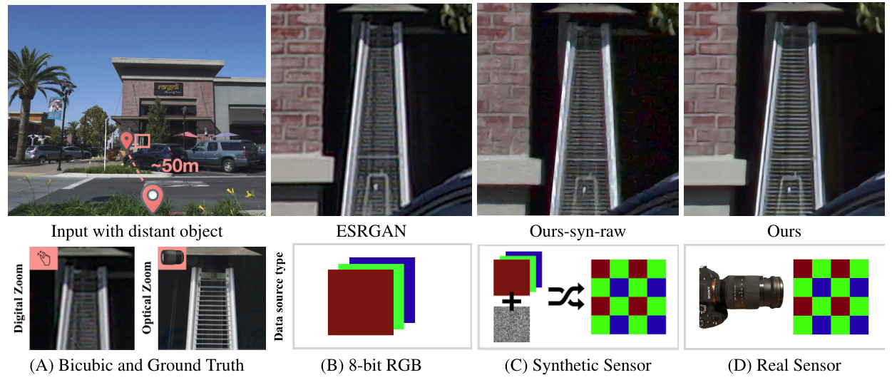

# zoom-learn-zoom

We added the training code for CVPR 2019 paper: Zoom to Learn, Learn to Zoom

The CVPR 2019 paper: Zoom to Learn, Learn to Zoom has achieved excellent performance in the direction of super resolution of natural scenes. Unfortunately, the author did not publish the training code itself. We supplemented and reproduced the training code.

CVPR2019年的论文 Zoom to Learn, Learn to Zoom 在自然场景超分辨率方向上取得了优异的表现，遗憾的是作者本身并没有公布训练代码，我们对训练代码进行了补充和效果复现。

<a href="https://ceciliavision.github.io/project-pages/project-zoom.html" target="_blank">Project Website</a>  |  <a href="https://arxiv.org/pdf/1905.05169.pdf" target="_blank">Paper</a>

This paper shows that when applying machine learning to digital zoom for photography, it is beneficial to use real, RAW sensor data for training. This code is based on tensorflow (tested on V 1.13.1). It has been tested on Ubuntu 16.04 LTS.

## 
